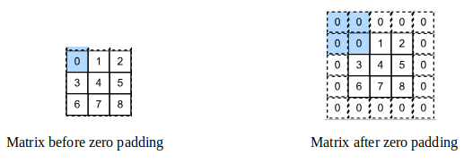
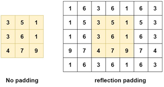
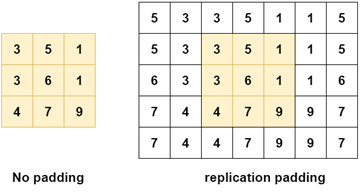
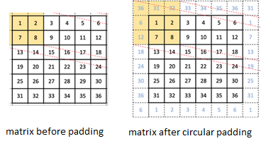
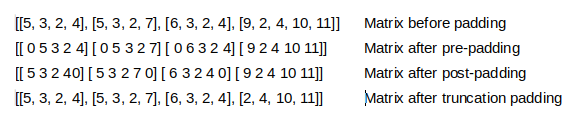

\doublespacing
\large
\justifying

#	Chapter Two

# Literature Review{-}

##	Introduction

|        This section surveys previous works done on facial recognition with a bias towards the objectives of this work. It begins with examining different types of methodologies that have been used for facial recognition before delving into how different types of neural networks have been used for facial recognition. Specifically, this proposal discusses how convolution neural networks, artificial neural networks, and how they have been used for facial recognition. It also discusses padding and how they can be applied to convolution neural networks mentioning different types of padding strategies. It is then that the paper examines and discusses different datasets used in facial recognition before discussing three facial recognition architectures that have been used in facial recognition.
	
##	Facial Recognition

|        Facial recognition is a biometric technique used to identify faces and match those faces to a database of faces with an aim of identifying a human being from an image. From the definition, it is clear that face recognition is a two-step process with the first step being face detection and the second step being face identification. The first step of facial recognition (or the face detection step) is identifying and extracting human faces from an image. In this step, all objects in an image are extracted and checked to confirm if a picture contains a human face. If any human face is present in the image, the face is extracted from the image before step two begins. In the second step or the image identification step, an image is compared to faces stored in a database to identify if the face matches the face of a known person. In short, there is a difference between facial detection and facial recognition and that facial recognition begins with facial detection and finalizes with facial identification.
	
###	Face Detection

|        Given an arbitrary image, the objective of facial detection is to establish whether or not there are any faces in the image and if present, return the image location and extent of each face (Yang et al., 2002). It is important to highlight that there are several methods that could be used for detecting faces from images. These methods include knowledge based methods, feature invariant approaches, template matching methods, and appearance based methods. Indeed, the mentioned methods are important when detecting faces from images, but all these methods are accompanied by several challenges. This owes to the reality that Yang et al., (2002) list the following five challenges that are associated with facial detection: - pose, occlusion, aging face expression, imaging conditions and image orientation. Moreover, face expression is not only a challenge in face detection but also in face recognition. It follows that researchers on facial recognition should identify methods of tackling the mentioned challenges associated with face detection.

####	Challenges in Face Detection\

**Pose**: A review of images databases will indicate that people like taking images in different poses. It follows that an image is likely to have a face that is twisted to the right, left, or even upside down. Moreover, some features such as the nose, eye, or ears maybe wholly or partially occluded which is an additional challenge in facial recognition. This problem is always solved by rotating images back to an upright position.

**Occlusion**: Human beings often have features that could affect image detection. For instance, men are known to have beards, which may or may not exist in images. It is also important to highlight that people at times wear spectacles, which also affects face detection. Moreover, COVID 19 forced people to wear masks, which present a unique challenge in facial recognition. 

**Aging**: Human faces are known to change with age progression which presents a challenge in facial recognition. This implies that there would be a significant difference in images if the time difference between the images is large. It is notable that aging will not be a challenge to this paper because people tend to change their smartphones for a few years. It is notable however that Singh and Prasad (2018) propose the use of coupled auto-encoder networks and non-linear analysis as a solution to the aging problem in facial recognition.

**Facial expressions**: Images of human faces could also be affected by their emotions because people can change their faces based on emotions they are experiencing. Critical to the discussion is the reality that Singh and Prasad (2018) cite expression invariant 3D face recognition as a solution to the problems of facial expressions in image recognition.
Imaging conditions and image orientation: A huge chunk of solutions in computer vision make the assumption that there is a single illuminant lighting in an image. Regardless, that is not always the case. As evidenced, Finlayson and Fredembach (2007) reveal that images always contain shadows depending on the positions from different lights that affect an image. Important to the debate is the truth that Finlayson (2018) proposes a solution to the problems arising from illumination in computer vision.

####	Face Detection Approaches\

**Knowledge Based Methods of Facial Detection**\
\vspace{-2.8em}

|        This method relies on a set of rules to detect whether there is a human face in an image. The method captures the human knowledge of faces and interprets the knowledge into a set of rules. For instance, the face has two symmetric eyes; the eye areas are darker than the cheeks, the distance between eyes, and the difference in colors between the eyes and cheeks. It is notable that using the knowledge base method for face detection could be difficult because it is difficult to develop a set of rules that can correctly identify a human face. This owes to the fact that there could be very many false positives if the rules are too general. Likewise, there could be many false negatives if the rules are too strict. This drawback has hampered researchers from using this technique. However, Chen et al., (2001) used the knowledge based method to detect faces in an image with an accuracy of 94%. One disadvantage with this method is that it is not efficient.

**The Feature Invariant Approach of Face Detection**\
\vspace{-2.8em}

|        The feature invariant method of face detection is a little bit different from the knowedge based method because it uses statistical methods on facial landmarks. Celiktutan et al, (2013) define a face landmark as a prominent feature that can play a discriminative role or can serve as anchor points in face detection. Examples of such landmarks include the eye corners, the nose tip, nostril corners, mouth corners, end points of eyebrow arcs, ear lobes, and the chin. This approach works by detecting facial landmarks, texture and skin color before using a statistical model to identify the presence of a face in an image. Critical to the discussion is the reality that different authors have used the feature invariant approach for face detection. For instance, Kapil and Jain (2013) compared texture based to the structure and shape based feature invariant based methods and concluded that the texture based method is more accurate. However, the authors argue that feature invariant based methods are computationally expensive.

**The Template Based Approach of Face Detection**\
\vspace{-2.8em}

|        This method functions to extract facial image features to gain the Euclidean distance value served as input face comparison value of the users’ faces stored in the database (Hidayat, Wibowo, Satria, Winursito, 2021). Simply put, the template based approach transforms an image into geometric primitives like curves and points. This is done by identifying distinctive features like the eye, the nose, the chin, and the mouth before measuring their relative positions, widths and other parameters of the distinctive features. Features extracted from an image are then compared to known features of a human face to check whether an image is that of a human face. For further elucidation the eye, nose, mouth and the chin are compared to that of a human face. If the features obtained from the image match those of a human face, then the object in question is declared to be a human face. It is vital to note that Hidayat, et al., (2021) assert that the template approach of facial recognition is known to have a lighter computational load than other methods because it does not require features from the entire face.

**The Appearance Based Approach of Facial Detection**\
\vspace{-2.8em}

|        The idea behind using Appearance methods for face detection relies on the linear algebra concept of subspaces. This approach of facial detection relies on the entire face, which is taken in as an input image data. The data collected from the input image is processed into a two dimensional pattern that is later used to decide whether there is a human face in an image. Critical to the discussion is the fact that this technique finds the best facial features because it rejects redundant information and keeps important information. Vital to the discussion is the fact that different authors have used the appearance based technique successfully. For example, Rusia and Singh (2023) used the appearance based technique of facial recognition and examined some of the face identity threats faced by this technique. Regardless, Yan et al., (2018) argues that appearance based methods are computationally expensive and have difficulty handling substantial amounts of facial variations. 

### Face Identification Approaches

|        As already mentioned, facial recognition is a two-step process with the first face being the face detection and the second step being the face identification step. The face identification phase is where facial characteristics are extracted from a detected face and compared to a known face to confirm if the facial characteristics match those of the known face. Evidence from literature suggests that the template approach and the appearance based approaches are not only used in face detection but could also be used in face identification. As evidenced, Proyecto (2010) discusses template matching and the appearance based technique in both face detection and face identification. It is important to highlight that different publications on techniques that are used in face identification exist.  Apart from template matching and appearance based methods, statistical approaches are also used in face identification.

####	Template Matching / Geometric Approaches\

|        The template matching or the geometric approach of facial recognition is similar to the template matching of the face detection step. However, the objective of the facial recognition step is different from the objective in the face identification step. This owes to the reality that the objective of the facial recognition step is to match a face to a known person while the objective in the face detection step is to identify whether an object in an image is a human face or not. Like in the face detection step, features like the eye, the nose, the chin, and the mouth are extracted from a human face before matching the features in question to a known face. Consider a face A belonging to a person B and a face C belonging to an unknown person. The template matching approach will collect facial characteristics from faces A and C. These characteristics from the unknown face C will be compared to characteristics from the known face A. If a match is found, then the decision will be that the unknown face C belongs to person B.

|        It is critical that several authors have applied the geometric approach of facial recognition in their studies. For example, Ghimire and Lee (2016) used the approach in question to predict emotions on a sequence of images that were extracted from videos. Specifically, Ghimire and Lee (2016) ran a multi-class AdaBoost algorithm and a support vector machines algorithm on the Cohn-Kanade (CK+) facial expression database and obtained an accuracy of 95.17% and 97.35% respectively. Another example of a study that used the geometric technique of facial recognition is one by Ayo et al., (2021). This owes to the reality that the authors in question used the geometric approach of facial recognition together with the you-only-look-once (YOLO) algorithm to predict age, gender and emotions. In their study, the authors were able to predict gender and emotions with an 80% accuracy. Regardless, Ayo et al., (2021) were not able to predict age accurately and mentioned that accurate age prediction was hampered by the lighting conditions of a face.

#### Appearance Based Methods\

|        Appearance based methods of face identification work the same way they work for face detection with the difference being the purpose of the method. This owes to the fact that the entire face is used to identify a face but with an aim of matching a face to that of a known person. It is important to highlight that this technique could be classified into linear and non-linear methods. Examples of linear methods include principal components analysis, independent component analysis, linear discriminant analysis, and linear regression classifier. Non-linear methods include kernel principal component analysis, local linear embedding, and kernel linear discriminant analysis. In a nonlinear approach the input image is mapped into higher dimensional space in which the face is simplified and linear. In principal component analysis a number of images are taken using gray levels. Each image is mapped to a long vector of gray levels. Several views of each person are collected in the database during training. During recognition a vector corresponding to an unknown face is compared with all vectors in the database (Viegas et al., 2019). 

|        It is imperative to mention that several authors have investigated the appearance based method for facial recognition. For instance, Struc and Pavesic (2009) examine the performance of appearance based methods subject to different environmental factors and conclude that the linear discriminant analysis produces the best results across different environmental conditions. Wu et al., (2018) also debate appearance based methods of facial recognition by examining facial expressions using the technique in question. The authors controlled for lighting conditions using a histogram equalization technique and a brightness preserving technique and concluded that the brightness preserving technique performs better than the histogram equalization technique. Broti (2019) also examines appearance based methods of facial recognition by discussing the principal components analysis, independent component analysis, linear discriminant analysis methods used in facial recognition. A drawback for this method is that it is challenging to find an efficient combination of dimensionality reduction technique and classifier. 

## Types of Neural Networks

|        The single layer neural network architecture is the basis of neural networks and has already been discussed in the introductory section of neural networks. Other types of neural networks include the multiple layer neural networks, radial basis functions neural networks, restricted Boltzmann machines, the convolution neural network, and the recurrent neural network. However, the multilayer neural network (ANN), and the convolution neural network will be discussed in this paper because those are some of the tools the researcher will be using in this study.

###	Multiple Layer Neural Network
|        As the title immediately above suggests a multilayer neural layer architecture is formulated when two or more networks are used to develop a neural network. A multilayer neural network consists of an input layer, which feeds in data to the first layer of the neural network. The first layer then feeds in data to at least one additional layer before sending the results to an output layer (for a case of a neural network with two layers). It is important to highlight that the training process of a multilayer neural network (also called artificial neural networks) involves the backpropagation algorithm or the generalized Delta rule (Da Silva et al., 2017). The backpropagation algorithm is best described as follows: The multilayer neural network begins by setting random weights during the first pass across the neurons. Upon reaching the output of the neuron, the weights are compared to the actual output and readjusted accordingly until the predicted value of the neuron is close to the actual value.

|        Artificial neural networks have been used for facial recognition widely. For example, Zhang et al., (2022) applied the artificial neural network algorithm on facial biological image information recognition and scanning. Specifically, the authors involved a methodology that used imaging technology to detect and extract the biological attributes of the image. In a different publication, Wang et al., (2021) conducted a study with an aim to examine the problem of identifying human faces given different and complex backgrounds. Specifically, the authors used neuron regenisis mechanism and the synapse mechanism to identify facial images from complex backgrounds. The scholars in question developed a model called Where-What Networks that is able to learn type, location and size, which is able to identify human faces from complex backgrounds. This is a clear indicator that researchers are using artificial neural networks for facial recognition and that much is yet to be seen on facial recognition.

|        Evidence from examining different publications on artificial indicates that they are being used for facial recognition. Regardless, artificial neural networks (ANN) are known to have their limitations. For example, Balarini et al., (2011) assert that ANNs require a lot of time to train a model. The problem becomes even worse if the number of neurons and hidden layers required to train a model is high. This problem is controversial because neural networks are known to register a high accuracy when a high number of neurons and hidden layers are used. Every neuron in each layer can make calculations independent of other neurons implying that graphics processing units could help solve the time problem required to train an ANN model. Another problem associated with ANNs is the vanishing gradient problem. Tarnate et al., (2020) define the vanishing gradient problem as a case when the neural network becomes too deep hence the network becomes hard to train and could result in a situation where network will not finish its training process.

|        It is evident that ANNs have their disadvantages, but that does not mean that there are no advantages of using them. For example, Roza and Mohsen (2021) discuss some of the advantages of ANNS arguing that they have an extraordinary ability of in learning well in the face of minor disturbances. In simple terms, ANNs are fault tolerant because a disturbance in one of the neurons will not prevent the entire network from generating an output. Another advantage of ANNs is the fact that they can learn and model non-linear and complicated interactions. This is crucial because many of the relationships between inputs and outputs in real-life situations are non-linear and complex. It is also notable that while the process of training ANNS takes time, they become efficient in the end because it would take a shorter time than creating a set of instructions using traditional programming.

###	Convolution Neural Networks

|        A Convolution neural network (CNN) is a type of artificial neural network that has one or more convolution layers and are used mainly for image processing, classification, and segmentation. CNNs are similar to ANNs described above only that they assume that the input is an image like dataset. Consequently, CNNs use a convolution layer, a pooling layer, a fully connected layer and an activation function layer, which makes them different from ANNs. Koodalsamy, et al., (2023) have a publication that discusses the layers used in convolution neural networks. Specifically, the convolution layer is where an image is subjected to a set of filters; the pooling layer is where the dimensionality of an image is reduced; the fully connected layer is where the output of the pooling layer is flattened; and the activation function is where a decision is made. A thorough discussion of all these layers will be discussed in the methodology section of this paper.

|        Like artificial neural networks, convolution neural networks have been used for facial recognition widely. For example, Xiaobo et al., (2023) recognize that facial recognition is hampered by factors such as posture, light and the background of the image. As a result, the authors proposed the addition of an attention mechanism to convolution neural networks in a bid to reduce the effects of factors that affect facial recognition. In a different paper, He et al., (2023) recognize that the existing methods on facial recognition ignore the effect of spatial relationships between predictors. Consequently, the authors introduced the use of a Group Depth-Wise Transpose Attention (GDTA) block, which is designed to establish long range dependencies in different facial features. This led to the development of a lightweight face recognition model, which the authors call CFormerFaceNet. Shalini et al., (2023) also did some work on facial recognition using CNNS by proposing the use of CNNs for creating attendance management systems that could be used for monitoring students’ classroom attendance.

|        It is important to highlight that CNNs have advantages that makes them suitable for deep learning. As evidence of this, Zhang et al., (2018) discusses some of the advantages of using convolutional neural networks. According to the authors, CNNs bypass the feature engineering stage of deep learning because feature engineering in CNNs is done during the training time. Another advantage of convolution neural networks is that they allow weight sharing, which in turn improves the efficiency of CNNs. Critical to the discussion is the fact that weight sharing is a wide topic that has been discussed by several authors including Dupuis et al., (2021) and cannot be discussed exhaustively in this paper. The last advantage of convolution neural networks is that they are able to identify spatial relationships in images. The concept of spatial relationships is well understood using the following example: Given an image, where is the nose in relation to the eyes and years. Clearly, the advantages of CNNs make them suitable for facial recognition.

|        The fact that CNNs produce reliable results when used for computer vision does not imply that there are disadvantages associated with CNNs. To begin with, convolution neural networks are known to perform poorly when used with negative images. Hosseini et al., (2017) defines negative images as those with reversed brightness, i.e., the lightest parts appear the darkest and the darkest parts appear lightest. The same authors conducted a study on the subject in question and concluded that the model accuracy of CNNs is slightly lower when tested on negative images. Like ANNs, CNNs also have a problem of vanishing gradients. Shah et al., (2016) is one of the authors who have examined the problem of vanishing gradients in convolutional neural networks. In simple terms, the authors acknowledge that vanishing gradients is a problem in CNNs and propose the use of an exponential linear unit. Vital to the debate is that Shah et al., (2016) show that the exponential linear unit improves not only the accuracy of CNNs, but also improves the training time.

####	Padding in Convolution Neural Networks\

|        Padding is one of the strategies used to develop convolution neural networks and often produces better results when used. What is padding? The term padding could be defined as a technique used in convolution neural networks where additional data is added to the edges of a dataset in order to prevent loss of information (Rio et al., 2020). This owes to the truth that filters used in CNNs always result in loss of information in the edges of a dataset. Critical to the discussion is the fact that a CNN could have more than one layer where filtering is done implying that a CNN model could implement padding in more than one layer. It is notable that evidence from literature reveals different types of padding strategies exist. Vital to the debate is the fact that different publications have different names for different padding strategies but they could refer to the same strategy.

**Types of Padding**\
\vspace{-2.8em}

**Zero Padding**: This padding strategy has been used widely and occurs when zeros are added around an image at the expense of cropping or resizing an image. It is vital to note that this strategy has an advantage of maintaining all features of an image because adding zeros around an image has no effect on the output image after the image is subjected to a kernel filter. 

```{r zero_pad, echo=F, out.width="80%", fig.cap="Matrix showing zero padding.", fig.align='center'}

```

**Same Padding**: This padding strategy is similar to zero padding when zeros are added to the edges of an image. However, a different figure, say 1, could be added on the edges of an image, which would make the padding strategy different from zero padding. This type of padding is also called constant padding.

**Valid Padding**: valid padding occurs when no extra data is placed at the borders of a matrix or image. Essentially, it is best understood as the absence of padding.

**Reflection Padding**: This padding technique works by extracting pixels from the border of an image and adding them to the same border in reverse order. It is notable that this padding technique is sometimes referred to as symmetric or edge padding.

```{r reflect_pad, echo=F, out.width="80%", fig.cap="Matrix showing reflection padding.", fig.align='center'}

```

**Replication Padding**: replication padding is almost similar to reflective padding only that rather than creating a reflection of the pixels around the edges of a matrix or image it duplicates adjacent values on the edges of the matrix or image. This padding strategy is also called mirror padding.

```{r rep_pad, echo=F, out.width="80%", fig.cap="Matrix showing replication padding.", fig.align='center'}

```

**Circular Padding**: Wraps the image values on one side around to the other side to provide the
the matrix with additional data that is required before a filter is applied. It is like data from the edges is extracted and placed in the opposite side of the matrix

```{r circ_pad, echo=F, out.width="80%", fig.cap="Matrix showing circular padding.", fig.align='center'}

```

**Sequence Padding**: is a type of padding strategy commonly applied to sequential or time series data. This padding technique is thoroughly documented by Rio et al., (2020) and can be divided into truncation padding, post-padding and pre-padding. Truncation padding occurs when items in an array are trimmed to have the same length as an array with the least length. Another padding strategy under sequence padding is post-padding and occurs when a chosen value (usually zero) is added at the end of short array items to make all short arrays equal to the longest array. Pre-padding is the opposite of post-padding and occurs when a chosen value (usually zero) is added at the beginning of shorter arrays in a bid to make them equal to the longest array. This type of padding could also be called causal padding.

```{r seq_pad, echo=F, out.width="80%", fig.cap="Matrix showing sequence padding.", fig.align='center'}

```

|        An array of studies have been published either introducing new padding strategies or applying the already existing padding techniques on different problems. For example, Nguyen et al., (2021) discusses padding strategies such as partial convolution padding, mean interpolation padding, and mean reflection padding. It is important to note that while the authors discuss the aforementioned padding strategies, the strategies are not the focal point of their publication. It is because the authors also discuss distribution padding and conduct an experiment on it. Eventually, the authors show that distribution padding performs better than zero padding in image classification problems. In a different publication, Ning et al., (2023) introduced the idea of learning-based padding arguing that it performs better than the traditional padding strategies. To be specific, the authors propose that learning based paradigms could be used to calculate padding values from data that is on the edge of images. The authors propose learning-based padding by attention and learning-based padding by convolution as methods that could be used to calculate padding values. 

|        Other authors have also investigated padding by developing new padding strategies or examining how padding affects the training process of neural networks. As evidence of this, Reddy and Reddy (2019) investigated the effect of post-padding and pre-padding in Long short-term memory (LSTM) neural networks and CNNs. The authors concluded that post-padding and pre-padding improve the accuracy of LSTMs but not CNNs because the architecture of CNNs forgets effects of time series variations. Tang et al., (2019) also investigate the effect of invalid and same padding using Pre-trained CNNs and concluded that padding with a stride size set with a value close to the half of the image dimension improves the performance. Another author, Cheng (2020), investigated the effect of zero padding at the bottom of a text only and on all sides of a text in natural language processing. Their study revealed that there is no difference between applying padding at the bottom of a text and on all sides of a text.	

|        Another publication investigating padding and how it relates to convolution neural networks is from Alrasheedi et al., (2023). The authors acknowledge that padding has been investigated shallowly. It is then, that they propose a padding technique that learns from shifts in hyper parameters of a CNN before adjusting padding effectively. Finally, Alrasheedi et al., (2023) introduce a padding module providing evidence that it performs better 1.49% and 0.44% more better in classification accuracy than the zero padding when tested on the VGG16 and ResNet50. Clearly a considerable number of publications investigating how padding affects convolution neural networks have been made. Regardless, the number of publications that investigate how padding affects CNNs in computer vision still remain low. This owes to the fact that only one study has been made investigating how padding affects CNNs has been made. Moreover, no study has been found investigating the effect of padding on CNNs with respect to facial recognition has been found. This is a clear indicator that this proposed study will add value to the already existing literature in facial recognition.

## Facial Recognition Datasets

|        An array of studies have been conducted on facial recognition implying that there exist several datasets that could be used for facial recognition. Ayad et al., (2023) conducted a study discussing twenty-one different datasets that have been used for research in facial recognition. This publication discusses main characteristics of each dataset and should be the first stop shop for authors looking to examine data sets used for facial recognition. Ortis and Becker (2013) also discuss facial recognition data sets only that they focus on web scale datasets. This owes to the fact that web scale datasets are created for facial recognition in real time and on the web. Such datasets should scale well and be ready to be used for tagging friends or finding celebrities online. Clearly, there are a lot of data sets that could be used for facial recognition. However, access to such datasets have been limited due to the recent changes in laws regarding access and use of personal identifiable information.

### Disguised Faces in The Wild Dataset

|        The disguised faces in the wild dataset contains 11,157 images collected from 1,000 different people. This data set was collected from the internet and was released in 2018 during the Disguised Faces in the Wild Workshop at International Conference on Computer Vision and Pattern Recognition (Singh et al., 2018). Critical to the discussion is the reality that the disguised faces in the wild (DFW) was developed with an aim of creating facial recognition models that are resistant to disguises. This owes to the fact that Singh et al., (2018) acknowledge that humans could artificially alter their faces with an aim of fooling a facial recognition system. For instance, an individual could try and fool a system by wearing a wig, wearing at artificial beard or putting on heavy make up. It is important to note that a different dataset called Disguised Faces in the Wild 2019 Dataset has been published and should be confused for the dataset under discussion (Singh et al., 2019). Clearly, this is an interesting subject of study that should be investigated further using the dataset in question.

### VGGFACE

|        VGG Face dataset is made up of 2.6 million images collected from 2,622 different people. This dataset comprises mostly of politicians, actors, public figures and celebrities, which was made by extracting male’s and females’ information from the Internet Movie Database and ranked by popularity (Parkhi et al., 2015). Critical to the discussion is the fact that this data set was examined by human annotators to eliminate images that could introduce noise into the dataset. It is important to highlight that this dataset has been used and cited by authors widely. For example, Ibrahem and Abdulameer (2023) examine a pretrained model that was created from this dataset to discuss a model aimed at solving the age problem associated with facial recognition. While the number of publications that have used this dataset remains low, the number of publications that have used the pretrained model from this dataset is high. This explains why the researcher will be using a pretrained model from this dataset for this study.

### KomNET Face Dataset

|        The KomNET face dataset comprises of 39,600 images but the number of people whose faces were collected from is not stated in the publication associated with the dataset (Astawa et al., 2020). It is however crucial to note that the dataset was collected from social media, collected using a digital camera, and a smartphone. As already mentioned, some of the challenges associated with facial recognition include occlusion and the lighting conditions in images. That said, it is important to highlight the dataset in question is limited by the fact that different lighting conditions were not taken into consideration while collecting the images. Moreover, the number of images collected was 1,200 images but they were subjected to augmentation to make them 39,600. Specifically, the images were subjected to augmentation techniques such as average blur, emboss, flip, gamma contrast, gaussian blur, histogram equalization, rotate, hue and saturation, sharpen, and sigmoid contrast (Astawa et al., 2020). 

## Facial Recognition Architectures

|        Apparently, there have been multiple studies on facial recognition implying there are multiples solutions to the problem of facial recognition. To add insult to injury, some authors have conducted reviews on some of the existing architectures on facial recognition. The term architecture here refers to a deep learning model that could be used to match or a recognize a face belonging to a particular person. An example of an author that has conducted review on facial recognition architectures is sun and Redei (2022). Specifically, the authors in question discuss architectures such as FaceNet, DeepFace, DeepID-Net, and Local binary patterns architectures. Gupta (2017) also reviewed some of the existing architectures in facial recognition. In particular, the author discusses architectures like WebFace, DeepFace, VGG Net, FaceNet, and DeepId. Critical to the discussion is that fact that the number of existing architectures could be more than 30 implying that discussing all these architectures would be daunting. It follows that this paper will only discuss selected architectures in order to stick to the scope of the paper.

### Google FaceNet

|        Google FaceNet, or popularly known as FaceNet, is a facial recognition architecture that was developed by researchers at Google. This architecture relies on an earlier architecture called Inception Network, which generates convolution and concatenates the revolutions to improve the efficiency of the architecture. While discussing Inception Network would be an interesting subject, going into the details of it is beyond the scope of this paper. Now, back to google net, the architecture relies on a technique called the triplet loss function, which calculates the distance (almost similar to the Euclidian distance) between three images and returns a positive value when a match is found (Schroff et al., 2015). Vital to the debate is the truth that this architecture has been testes on face datasets called the YouTube Face dataset and the Labelled Faces in the Wild dataset. Further, the architecture recorded an accuracy of 95.12% on the YouTube Face dataset and recorded an accuracy of 99.63% on the Labelled Faces in the Wild dataset (Sun and Redei, 2022). It should be noted however that FaceNet requires high performing computers in order to train the architecture on a new dataset.

### DeepFace

|        DeepFace was also produced by a giant company in technology. Specifically, Meta. Critical to the discussion is the fact Taigman et al., (2014) published the results from the study that produced DeepFace. It is important to note that the researchers introduced an idea of 3D modelling based on face fiducial points, which in turn is used to align faces. Simply put, the facial alignment methodology proposed by Taigman et al., (2014) can transform an image shown in figure 2.6 (a) to an image shown in figure 2.6 (b). Resulting images from facial alignment are then subjected to a deep convolution neural network architecture that is thoroughly documented by Taigman et al., (2014). Vital to the discussion is the fact that the DeepFace architecture was tested on the Labelled Faces in the Wild dataset, and the YouTube Faces dataset. It follows that this architecture achieved an accuracy of 97.5% in the Labelled Faces in the Wild dataset and a 91.4% accuracy on the YouTube Faces dataset.
 
