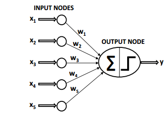
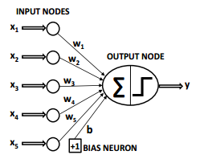
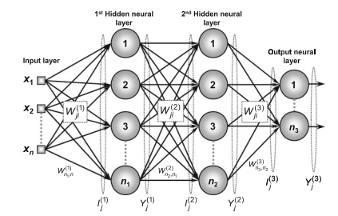
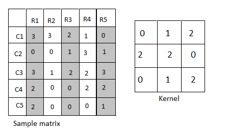
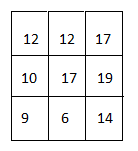
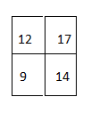
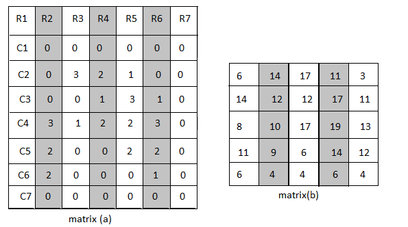
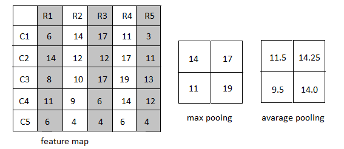

\onehalfspacing
\normalsize
\justifying

#	Chapter Three
\vspace{-1em}

# Methodology{-}

##	Introduction
|        This section discusses the theory behind neural networks by deriving the back propagation algorithm. The section also discusses techniques used in convolution neural networks by describing how CNNs extract data from images. Specifically, this section focuses on major techniques used in CNNs such as filtering, strides, padding, pooling and batch normalization.
## Artificial Neural Networks
|        Artificial neural networks is a machine learning technique that tries to imitate the intelligence of a human brain. The human brain contains neurons that are connected to one another through axons and dendrites. The connecting region between axons and dendrites is called a synapse. The strength of synaptic connections often changes due to changes in external stimuli, which in turn influence how learning occurs in the human brain (Agrawal and Singh, 2015). Like biological neurons, artificial neural networks contain computational units called neurons. These computational units are connected to one another through weights that perform the same role as synapses in biological neurons. An artificial neural network computes a function of the inputs by propagating the computed values from the input neurons to the output neuron(s) and using the weights as intermediate parameters. Learning occurs by changing the weights connecting the neurons.

```{r ann, echo=F, out.width="80%", fig.cap="Artificial Neural Network.", fig.align='center', fig_caption= TRUE}

```

|        The simplest form of a neural network is called a perceptron and includes a single input layer, an activation function, and the output layer. Consider the image shown in figure 1.0 above and the case of a binary response variable $(Y)$ with 1 is the presence of an observed parameter and 0 the absence of the observed parameter. The input layer contains predictor variables $(X_1, X_2, …, X_n)$ with weights $(W_1, W_2, \ldots, W_n)$, which are mapped to the output node Y using an activation function. The activation function takes in the computed probability of the function of the weights $W_i$ and predictor variable $X_i$ and produces a probability of the response variable being 1 or 0. The activation function then takes the predicted probability and produces an output 1 if the predicted probability is close to 1 and produces an output 0 if the predicted probability is close to 1. It follows that the perceptron neural network can be computed using the formula in equation 3.1 below.
\begin{equation}
\begin{aligned}
\hat{Y} = \sum_{i=0}^{n} W_i X_i
\end{aligned}
\label{eq:equation 3.1}
\end{equation}

|        While equation 3.1 above  may work in a variety of settings, there are instances where we need to introduce a bias to a neural network for it to work accordingly (Agrawal and Singh, 2015). The mentioned bias could be compared to penalizing a regression model. Basically, we introduce a bias neuron that shifts the line of fit to the right or left depending on the original position of the line of fit. Another way to think about biases is simply by considering any linear function, y = mx + b. Let's say you are using y to approximate some linear function z. If z has a non-zero z-intercept, and you have no bias in the equation for y (i.e. y = mx), then y can never perfectly fit z. Similarly, if the neurons in your network have no bias terms, then it can be harder for your network to approximate some functions. The figure 3.2 below shows an example of neural network architecture with a single bias neuron.

```{r ann_with_bias, echo=F, out.width="80%", fig.cap="Artificial Neural Network.", fig.align='center', fig_caption= TRUE}

```

Thus, the perceptron of a single layer neural network is shown in the formula 3.2 below. The output is represented by $Y_hat$, which is equal to the sum of weight $W(W_1, W_2, …, W_n)$ multiplied by the predictor variables $X(X_1, X_2, …, X_n)$ plus the bias neuron $b$.
\begin{equation}
\begin{aligned}
\hat{Y} = \sum_{i=0}^{n} W_i X_i + b
\end{aligned}
\label{eq:equation 3.2}
\end{equation}

## Deriving the Backpropagation Algorithm
Let $W_{ji}^L$ be the weight matrices denoting the value of the synaptic weight that connects the $j^{th}$ neuron of layer $(L)$ to the $i^{th}$ neuron of layer $(L − 1)$. Consider the image in the figure 3.3 below

\begin{enumerate}[label=\Roman*]
\item $W_{ji}^{(3)}$ Is the synaptic weight connecting the $j^{th}$ neuron of output layer to the $i^{th}$ neuron of layer 2.
\item $W_{ji}^{(2)}$ Is the synaptic weight connecting the $j^{th}$ neuron of hidden layer 2 to the $i^{th}$ neuron of layer 1.
\item $W_{ji}^{(1)}$ Is the synaptic weight connecting the $j^{th}$ neuron of hidden layer 1 to the $i^{th}$ signal of the input layer.
\end{enumerate}

```{r ann_proof, echo=F, out.width="80%", fig.cap="Artificial Neural Network.", fig.align='center', fig_caption= TRUE}

```
Let $I_{j}^L$ be vectors whose elements denote the weighted inputs of the $j^{th}$ neuron of layer $L$ and are defined as the following.

\vspace{-1em} 
\begin{equation}
\begin{aligned}
I_{j}^1 = \sum_{i=0}^{n} W_{i}^1 x_i \iff I_{j}^1 = W_{1,0}^1*x_0 + W_{1,1}^1*x_1 + \dots + W_{1,n}^1*x_n
\label{eq:equation 3.3}
\end{aligned}
\end{equation}
\vspace{-2em} 

\begin{equation}
\begin{aligned}
I_{j}^2 = \sum_{i=0}^{n} W_{i}^2 x_i \iff I_{j}^2 = W_{1,0}^2*x_0 + W_{1,1}^2*x_1 + \dots + W_{1,n}^2*x_n
\label{eq:equation 3.4}
\end{aligned}
\end{equation}
\vspace{-2em}

\begin{equation}
\begin{aligned}
I_{j}^3 = \sum_{i=0}^{n} W_{i}^3 x_i \iff I_{j}^3 = W_{1,0}^3*x_0 + W_{1,1}^3*x_1 + \dots + W_{1,n}^3*x_n
\label{eq:equation 3.5}
\end{aligned}
\end{equation}
\vspace{-1em}

Let $Y_{j}^L$ be vectors whose elements denote the output of the $j^{th}$ neuron related to the layer $L$ and are defined as:
\vspace{-1em}
\begin{equation}
\begin{aligned}
Y_{j}^1 = g(I_{j}^1)
\label{eq:equation 3.6}
\end{aligned}
\end{equation}
\vspace{-2em}

\begin{equation}
\begin{aligned}
Y_{j}^2 = g(I_{j}^2)
\label{eq:equation 3.7}
\end{aligned}
\end{equation}
\vspace{-2em}

\begin{equation}
\begin{aligned}
Y_{j}^3 = g(I_{j}^3)
\label{eq:equation 3.8}
\end{aligned}
\end{equation}
\vspace{-1em}

Another important aspect of the backpropagation is the chain rule, which is defined as: $\frac{d}{dx} f(g(x)) = f'(g(x)) \cdot g'(x)$. The next step of deriving the backpropagation algorithm involves defining a function that can represent the approximation error. It is important to highlight that this function will measure the deviation between the actual values and the predicted values. As a result, the squared error function is employed to measure the deviation in question. This error function will be defined as shown in equation 3.9 below.

\vspace{-1em}
\begin{equation}
\begin{aligned}
E(k) = \frac{1}{2} \sum_{j=1}^{n3} \left( d_j(k) - y_j^3(k) \right)^2
\label{eq:equation 3.9}
\end{aligned}
\end{equation}
\vspace{-1em}

Where $y_{j}^3 (k)$  is the value produced by the $j^{th}$ output neuron of the network for the $k^{th}$ training sample, while $d_j (k)$ is the corresponding desired value. If there are $p$ training samples the performance of the backpropagation algorithm would be calculated using the mean squared error defined by

\vspace{-1em}
\begin{equation}
\begin{aligned}
E_m = \frac{1}{p} \sum_{k=1}^{p} E(k)
\label{eq:equation 3.10}
\end{aligned}
\end{equation}
\vspace{-1em}

Where $E(k)$ is the squared error obtained in equation 3.9. In order to communicate the derivation of the backpropagation algorithm the process will be divided into two parts. The first part will focus on the synaptic adjustment of weight matrix $w_{ji}^(3)$, which represents the output layer. The second part will focus on adjusting intermediate layers $w_{ji}^(2)$ and $w_{ji}^(1)$.

### Adjusting the Synaptic Weights of the Output Layer
|        Prior to diving into the mathematics of deriving the backpropagation algorithm, it should be noted that the purpose of the training process in output layer is to minimize the error between predicted and actual values. This will be achieved by minimizing the difference between the predicted and actual values. In short, the objective is to obtain an optimal $w^*$ so that the squared error ${E(w^*)}$ of the whole sample set is as low as possible. Using the chain rule, we differentiate equation 3.9 as shown in equation 3.11 below.

\vspace{-1em}
\begin{equation}
\begin{aligned}
\nabla E^3 = \frac{\partial E}{\partial W_{ji}^{(3)}} = \frac{\partial E}{\partial Y_j^{(3)}} \cdot \frac{\partial Y_j^{(3)}}{\partial I_j^{(3)}} \cdot \frac{\partial I_j^{(3)}}{\partial W_{ji}^{(3)}}
\label{eq:equation 3.11}
\end{aligned}
\end{equation}
\vspace{-1em}


\vspace{-1em}
\begin{equation}
\begin{aligned}
\frac{\partial I_j^{(3)}}{\partial W_{ji}^{(3)}} = Y_i^{(2)} 
\label{eq:equation 3.12}
\end{aligned}
\end{equation}
\vspace{-1em}

Obtained from the partial derivative of equation 3.5 with respect to $W_{ji}$

\vspace{-1em}
\begin{equation}
\begin{aligned}
\frac{\partial Y_j^{(3)}}{\partial I_j^{(3)}} = g'(I_j^{(3)})
\label{eq:equation 3.13}
\end{aligned}
\end{equation}
\vspace{-1em}

Obtained from equation 3.8. Where $g'$ denotes the first order derivative of the activation function.

\vspace{-1em}
\begin{equation}
\begin{aligned}
\frac{\partial E}{\partial Y_j^{(3)}} = -(d_j - Y_j^{(3)})
\label{eq:equation 3.14}
\end{aligned}
\end{equation}
\vspace{-1em}

Obtained from equation 3.9. Replacing equations 3.12, 3.13 and 3.14 in equation 3.11 we get:

\vspace{-1em}
\begin{equation}
\begin{aligned}
\frac{\partial E}{\partial W_{ji}^{(3)}} = -(d_j - Y_j^{(3)}) \cdot g'(I_j^{(3)}) \cdot Y_i^{(2)}
\label{eq:equation 3.15}
\end{aligned}
\end{equation}
\vspace{-1em}

\vspace{-1em}
\begin{equation}
\begin{aligned}
\delta_j^{(3)} = -(d_j - Y_j^{(3)}) \cdot g'(I_j^{(3)}) \quad \text{and} \quad \eta \text{ be the learning rate.}
\label{eq:equation 3.16}
\end{aligned}
\end{equation}
\vspace{-1em}

Also, note that the direction of the weight $W_{ji}^{(3)}$ matrix must be made in the opposite direction of the gradient because the optimization goal is to minimize the squared error (Da Silva et al., 2017). 

\vspace{-1em}
\begin{equation}
\begin{aligned}
\Delta W_{ji}^{(3)} = -\eta \cdot \frac{\partial E}{\partial W_{ji}^{(3)}} \iff \Delta W_{ji}^{(3)} = \eta \cdot \delta_j^{(3)} \cdot Y_i^{(2)}
\label{eq:equation 3.17}
\end{aligned}
\end{equation}
\vspace{-1em}

Equation 3.16 can also be written as

\vspace{-1em}
\begin{equation}
\begin{aligned}
W_{ji}^{\text{current}} = W_{ji}^{\text{previous}} + \eta \cdot \delta_j^{(3)} \cdot Y_i^{(2)}
\label{eq:equation 3.18}
\end{aligned}
\end{equation}
\vspace{-1em}

In short, we have shown through equation 3.17 that the neuron adjusts weights of the output layer by considering the difference the observed values and the actual values.

#### Adjusting the Synaptic Weights of the Intermediate Layers
|        Unlike the neurons in the output layer, neurons in the intermediate layers do not have access to the actual values. It follows that adjustments in the intermediate layers rely on neurons in the aftermost layers for feedback.

### Adjusting the synaptic weights of the second hidden layer
|        In order to train the second neural layer, we need to adjust the weight matrix $W_{ji}^{(2)}$ so as to minimize the error between outputs produced by the network and the adjustment produced in the output layer. 

\vspace{-1em}
\begin{equation}
\begin{aligned}
\nabla E^{(2)} = \frac{\partial E}{\partial W_{ji}^{(2)}} = \frac{\partial E}{\partial Y_j^{(2)}} \cdot \frac{\partial Y_j^{(2)}}{\partial I_j^{(2)}} \cdot \frac{\partial I_j^{(2)}}{\partial W_{ji}^{(2)}}
\label{eq:equation 3.19}
\end{aligned}
\end{equation}
\vspace{-1em}

\vspace{-1em}
\begin{equation}
\begin{aligned}
\frac{\partial I_j^{(i)}}{\partial W_{ji}^{(i)}} = Y_i 
\label{eq:equation 3.20}
\end{aligned}
\end{equation}
\vspace{-1em}

Obtained from the partial derivative of equation 3.4 with respect to $W_{ji})$

\vspace{-1em}
\begin{equation}
\begin{aligned}
\frac{\partial Y_j^{(2)}}{\partial I_{ji}^{(2)}} = g'(I_j^{(2)}) 
\label{eq:equation 3.21}
\end{aligned}
\end{equation}
\vspace{-1em}

Obtained from equation 3.7

\vspace{-1em}
\begin{equation}
\begin{aligned}
\frac{\partial E}{\partial Y_j^{(2)}} = \sum_{k=1}^{n3} \frac{\partial E}{\partial I_j^{(3)}} \cdot \frac{\partial I_k^{(3)}}{\partial Y_j^{(2)}} = 
\underbrace{\sum_{k=1}^{n3} \frac{\partial E}{\partial I_k^{(3)}}}_{\text{parcel (i)}} 
\cdot 
\underbrace{\frac{\partial \sum_{k=1}^{n3} W_kj^{(3)} \cdot Y_j^{(2)}}{\partial Y_j^{(2)}}}_{\text{parcel (ii)}}
\label{eq:equation 3.22}
\end{aligned}
\end{equation}
\vspace{-1em}

Note that the partial derivative of parcel (ii) with respect to $Y_j^{(2)}$ is the value of $W_k^{(3)}$. Thus equation 3.21 becomes:

\vspace{-1em}
\begin{equation}
\begin{aligned}
\frac{\partial E}{\partial Y_j^{(2)}} = \underbrace{\sum_{k=1}^{n3} \frac{\partial E}{\partial I_k^{(3)}}}_{\text{parcel (i)}} \cdot \underbrace{W_{kj}^{(3)}}_{\text{parcel (ii)}}
\label{eq:equation 3.23}
\end{aligned}
\end{equation}
\vspace{-1em}

|        The value of parcel (ii) in equation 3.22 represents the synaptic weight of neurons from the output layer that is connected to the neuron j of the second intermediate layer. Also, the weights $W_{ji}^{(3)}$ have been adjusted in the previous step based on errors, which will be used to adjust weights in the second intermediate layer. Moving on to parcel (i) in equation 3.22, the result can be simplified by multiplying equations 3.13 and 3.14 together, which results in the actual value of $δ_j^3$ defined in equation 3.16 defined above. Thus, substituting in equation 3.22 becomes:

\vspace{-1em}
\begin{equation}
\begin{aligned}
\frac{\partial E}{\partial Y_j^{(2)}} = - \sum_{k=1}^{n_3} \delta_k^3 W_{kj}^{(3)}
\label{eq:equation 3.24}
\end{aligned}
\end{equation}
\vspace{-1em}

Substituting equations 3.19, 3.20, and 3.23 in equation 3.18

\vspace{-1em}
\begin{equation}
\begin{aligned}
\frac{\partial E}{\partial Y_j^{(2)}} = -\left( \sum_{k=1}^{n3} \delta_k^{(3)} \cdot W_{kj}^{(3)} \right) \cdot g'(I_j^{(2)}) \cdot Y_i^{(1)}
\label{eq:equation 3.25}
\end{aligned}
\end{equation}
\vspace{-1em}

Da Silva et al., (2017) posit that the adjustment of the weight matrix $W_{ji}^{(2)}$ must be made in the opposite direction of the gradient in order to minimize the error. Thus:


\vspace{-1em}
\begin{equation}
\begin{aligned}
\Delta W_{ji}^{(2)} = - \eta \frac{\partial E}{\partial W_{ji}^2} \quad \iff \quad \Delta W_{ji}^{(2)} = \eta \delta_j^{(2)} Y_i^{(1)}
\label{eq:equation 3.26}
\end{aligned}
\end{equation}
\vspace{-1em}

Where

\vspace{-1em}
\begin{equation}
\begin{aligned}
\delta_j^{(2)} = - \left( \sum_{k=1}^{n_3} \delta_k^{(3)} W_{kj}^{(3)} \right) g'(I_j^{(2)})
\label{eq:equation 3.27}
\end{aligned}
\end{equation}
\vspace{-1em}

Equation 2.23 can also be written as 

\vspace{-1em}
\begin{equation}
\begin{aligned}
W_{ji}^{(2)}(t+1) = W_{ji}^{(2)}(t) + \eta \delta_j^{(2)} Y_i^{(1)}
\label{eq:equation 3.28}
\end{aligned}
\end{equation}
\vspace{-1em}

In short, we have shown that that equation 3.27 adjusts weights from neurons in the second hidden layer by considering backpropagation errors originating from the neurons in the output layer.

#### Adjusting the synaptic weights of the first hidden layer
|        The objective of the training process of the first hidden layer consists of adjusting the weight matrix $W_{ji}^{(1)}$ in order to minimize the error between the output produced by the network and the backpropagated error originating from the adjustment of the neurons in the second hidden layer. Thus, we have:

\vspace{-1em}
\begin{equation}
\begin{aligned}
\nabla E^{(1)} = \frac{\partial E}{\partial W_{ji}^{(1)}} = \frac{\partial E}{\partial Y_j^{(1)}} \cdot \frac{\partial Y_j^{(1)}}{\partial I_j^{(1)}} \cdot \frac{\partial I_j^{(1)}}{\partial W_{ji}^{(1)}}
\label{eq:equation 3.29}
\end{aligned}
\end{equation}
\vspace{-1em}

\vspace{-1em}
\begin{equation}
\begin{aligned}
\frac{\partial I_j^{(1)}}{\partial W_{ji}^{(1)}} = X_i
\label{eq:equation 3.30}
\end{aligned}
\end{equation}
\vspace{-1em}

Obtained from the partial derivative of 3.3 with respect to $W_{ji}$

\vspace{-1em}
\begin{equation}
\begin{aligned}
\frac{\partial Y_j^{(1)}}{\partial I_{ji}^{(1)}} = g'(I_j^{(1)})
\label{eq:equation 3.31}
\end{aligned}
\end{equation}
\vspace{-1em}

Obtained from equation 3.6

\vspace{-1em}
\begin{equation}
\begin{aligned}
\frac{\partial E}{\partial Y_j^{(1)}} = \sum_{k=1}^{n_2} \frac{\partial E}{\partial I_j^{(2)}} \cdot \frac{\partial I_k^{(2)}}{\partial Y_j^{(1)}} = \underbrace{\sum_{k=1}^{n_2} \frac{\partial E}{\partial I_k^{(2)}}}_{\text{parcel (i)}} \cdot \underbrace{\frac{\partial \sum_{k=1}^{n_2} W_kj^{(2)} Y_j^{(1)}}{\partial Y_j^{(1)}}}_{\text{parcel (ii)}}
\label{eq:equation 3.32}
\end{aligned}
\end{equation}
\vspace{-1em}

Note that the partial derivative of parcel (ii) with respect to $Y_j^{(2)}$ is the value of $W_k^{(2)}$. Thus, equation 3.32 becomes:


\vspace{-1em}
\begin{equation}
\begin{aligned}
\frac{\partial E}{\partial Y_j^{(1)}} = \underbrace{\sum_{k=1}^{n_2} \frac{\partial E}{\partial I_k^{(2)}}}_{\text{parcel (i)}} \cdot \underbrace{W_{kj}^{(2)}}_{\text{parcel (ii)}}
\label{eq:equation 3.33}
\end{aligned}
\end{equation}
\vspace{-1em}

|        The value of parcel (ii) in equation 3.33 relates to the synaptic weights of neurons from the second hidden layer. It is important to emphasize that all the weights of $W_{ji}^{(2)}$ were adjusted in the previous step based on the backpropagated errors from the adjustment of the weights of $W_{ji}^{(2)}$, which in turn were adjusted based on the real values of the error. Parcel (i) in equation 2.30 can be obtained by multiplying equations 3.21 and 3.22, which will result in the value of $δ_j^{(2)}$ obtained in equation 3.27.
Making appropriate substitutions equation 3.32 becomes

\vspace{-1em}
\begin{equation}
\begin{aligned}
\frac{\partial E}{\partial Y_j^{(1)}} = - \sum_{k=1}^{n_2} \delta_k^{(2)} W_{kj}^{(2)}
\label{eq:equation 3.34}
\end{aligned}
\end{equation}
\vspace{-1em}

Substituting equations 3.30, 3.31 and 3.34 in equation 3.29 we get

\vspace{-1em}
\begin{equation}
\begin{aligned}
\frac{\partial E}{\partial W_{ji}^{(1)}} = - \left( \sum_{k=1}^{n_2} \delta_k^{(2)} W_{kj}^{(2)} \right) g'(I_j^{(1)}) X_i
\label{eq:equation 3.35}
\end{aligned}
\end{equation}
\vspace{-1em}


In short, the adjustment of the weight matrix $W_{ji}^{(1)}$ should be made in the opposite direction of the gradient in order to minimize the error.


\vspace{-1em}
\begin{equation}
\begin{aligned}
\Delta W_{ji}^{(1)} = - \eta \frac{\partial E}{\partial W_{ji}^{(1)}} \quad \leftrightarrow \quad \Delta W_{ji}^{(1)} = \eta \delta_j^{(i)} X_i
\label{eq:equation 3.36}
\end{aligned}
\end{equation}
\vspace{-1em}


Where


\vspace{-1em}
\begin{equation}
\begin{aligned}
\delta_j^{(1)} = - \left( \sum_{k=1}^{n_2} \delta_k^{(2)} W_{kj}^{(2)} \right) g'(I_j^{(i)})
\label{eq:equation 3.37}
\end{aligned}
\end{equation}
\vspace{-1em}

Equation 3.37 can also be written as 


\vspace{-1em}
\begin{equation}
\begin{aligned}
W_{ji}^{(1)}(t+1) = W_{ji}^{(1)}(t) + \eta \delta_j^{(1)} X_i^{(1)}
\label{eq:equation 3.38}
\end{aligned}
\end{equation}
\vspace{-1em}

Therefore, expression (3.38) adjusts the weight of the neurons from the second hidden layer, using the backpropagation of the error originated from the neurons of the output layer

## Convolution Neural Network Architecture

|        Convolution neural networks rely on their architecture to make predictions from inputs. This architecture can be divided into feature extraction and model prediction. The feature extraction phase relies on techniques such as filtering, the stride, padding, pooling and flattening. In order to explain how each of these techniques contributes to the architecture of the neural network we shall rely on the image shown in figure 3.4 below.

```{r matrix_and_kernel, echo=F, out.width="80%", fig.cap="Sample Matrix and a Kernel.", fig.align='center', fig_caption= TRUE}

```

### Filtering in Convolution Neural Networks

|        In order to understand how filtering works, we need to consider figure 3.4. The kernel slides over the sample matrix and takes the dot product between the kernel and a 3 by 3 matrix from rows in the sample matrix. For example, the kernel slides from R1 to row R3 and from column C1 to column C3 and multiplies the resulting matrix with the kernel. In this case, the result of the dot multiplication is 12. It then slides over and beginning form row R2 to row R4 and column C1 to column C3. The result of this dot multiplication is also 12. The last filter happens from row R3 to row R5 and column C1 to column c3. The result from this dot multiplication is 17. The kernel then moves one column downwards and takes a 3 by 3 matrix from row R1 column C2 to row R3 column C4 and multiplies itself with this matrix to give 10. Holding the same columns, the kernel slides from row R2 to row R4 and multiplies the resulting matrix with itself to give 17.  It then slides from row R3 to R5 and multiplies the resulting matrix with itself to give 19. The procedure is through rows R1 to R5 and columns C3 to C5 to give 9, 6 and 14 as the results. The results are combined into what is called the feature map and is shown in figure 3.5 below.

```{r feature_map_1, echo=F, out.width="80%", fig.cap="Feature Map Resulting from a Kernel Filter.", fig.align='center', fig_caption= TRUE}

```

### Strides in Convolution Neural Network

|        A stride in convolution neural networks could be defined as a step used by the filter(kernel) to slide over the input image. A stride of 1 means that the filter moves one pixel at a time, while a stride of 2 means it moves two pixels at a time. Let us take figure 3.4 into consideration (assuming that we have a stride of 1) and use it to explain how strides are used in convolution neural networks. The filter will begin in the same position as the filtering process i.e. from R1 to row R3 and from column C1 to column C3 and multiplies the resulting matrix with the kernel. In this case, the result of the dot multiplication is 12. It will then move one pixel to the right and begin filtering from row R3 to row R5 and column C1 to column c3. The result from this dot multiplication is 17. Moving downwards the stride will skip one pixel downwards and begin the filtering process from column C3 to column C5 to give 9 as the result. It will then skip one row and begin filtering from row R3 column C3 which will give 14 as the result. In short, the matrix and kernel in figure 3.4 and a stride of 1 will produce a feature map shown in figure 3.6 below.

```{r strides, echo=F, out.width="80%", fig.cap="Image Showing The Output after a Stride of 1.", fig.align='center', fig_caption= TRUE}

```

###	Padding in Convolution Neural Networks

|        While this paper discussed padding, it has not touched on how padding is used in CNNs. This is why it is important to demonstrate how padding: -specifically zero padding, is used in convolution neural networks. This owes to the fact that the paper will create a facial recognition model with zero padding and no padding in order to investigate the effect of padding in facial recognition. Zero padding in CNNs is achieved by adding zeros around an input image before filtering is applied to the resulting matrix in order to create a feature map. Consider the matrix in figure 3.4, adding zeros around the matrix produces the matrix (a) in figure 3.7 below. The matrix (a) in figure 3.7 below is then subjected to a filter using the kernel in figure 3.4 to produce the matrix(b) in figure 3.7 below. It is important to note that the dimension of the matrix(b) in figure 3.7 below is equal to the dimension of the sample matrix in figure 3.4 above

```{r padding, echo=F, out.width="80%", fig.cap="Image Showing How Padding is Applied in CNNs.", fig.align='center', fig_caption= TRUE}

```

|        Pooling is a technique used to reduce a feature map into a much smaller dimension while maintaining critical features from a feature map. Critical to the discussion is the fact that there are two main pooling techniques used by CNNs: - max pooling and average pooling. The max pooling technique divides the feature map into 2 by 2 matrices and selects the maximum value from each of the divided matrices before combining the result into a matrix. Let us consider a pooling size of 2 by 2 and a feature map shown in figure 3.8 below. Max pooling and average pooling will divide the feature map in the following ways.
\begin{enumerate}[label=\Roman*]
\item From row R1 column C1 to row R2 column C2.
\item From row R3 column C1 to row R4 column C2.
\item From row R1 column C3 to row R2 column C4.
\item From row R3 column C3 to row R4 column C4.
\end{enumerate}	
Max pooling combines results above by taking the maximum value from each matrix and concatenating the result as shown in figure 3.8 below. In contrast, rather than take the maximum value from each matrix it finds the averages and concatenates the results as shown in the matrix called average pooling in figure 3.8 below.

```{r pooling, echo=F, out.width="80%", fig.cap="Image Showing MAx and Average Pooling in CNNs.", fig.align='center', fig_caption= TRUE}

```

This paper will implement max pooling of size 2 by 2.

### Batch Normalization

|        Batch normalization is used by neural networks to improve the speed and stability of the training process. Critical to the discussion is the fact that Sergey and Szegedy (2015) have a publication on some of the benefits of batch normalization. This owes to the fact that batch normalization does not only improve the speed and the stability of the training process, but also reduces the internal covariate shift. The term internal covariate shift could be defined as a phenomenon where the distribution of outputs of a neural network change when the model is still being updated. That said, this technique occurs by adjusting the values in each variable using the mean, standard deviation, scaling parameter, and a bias. This is done using equation 3.39 below. It is important to highlight that the scaling parameter and the bias, like the weights of a neural network, are adjusted in order to minimize the loss function.

\vspace{-1em}
\begin{equation}
\begin{aligned}
y_i = \gamma(x_i) + \beta
\label{eq:equation 3.39}
\end{aligned}
\end{equation}
\vspace{-1em}

Where

\vspace{-1em}
\begin{equation}
\begin{aligned}
\hat{x}_i = \frac{x_i - \mu_{\beta}}{\sqrt{\delta_{\beta}^2} + \epsilon}
\label{eq:equation 3.40}
\end{aligned}
\end{equation}
\vspace{-1em}
